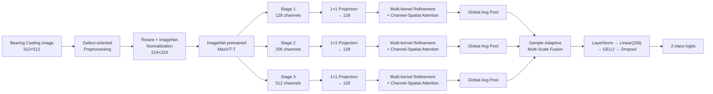
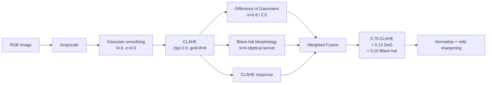

<div align="center">

# DefectNet
### An Efficient Edge-Deployable Hierarchical Transformer for Real-Time Bearing Casting Defect Diagnosis

**Defect-oriented preprocessing · Hierarchical MaxViT features · Multi-kernel refinement · Channel-spatial attention · Sample-adaptive multi-scale fusion · Explainability · Edge deployment**


</div>

---

## TL;DR

**DefectNet** is a hierarchical transformer framework for binary classification of **defective (`def_front`)** and **defect-free (`ok_front`)** bearing casting surfaces. It combines a defect-oriented image preprocessing pipeline with an ImageNet-pretrained **MaxViT-T** backbone, multi-kernel defect enhancement, channel-spatial attention, and sample-adaptive multi-scale feature fusion.

On the independent test set, DefectNet achieves **99.24% accuracy**, **0.9936 F1-score**, **0.9873 sensitivity**, **1.0000 specificity**, and **1.0000 ROC-AUC / PR-AUC**. The framework contains **30.536M parameters**, requires **11.283 GFLOPs**, and reaches **219.656 images/s** with batch size 8.

> This repository is designed to make the complete experimental pipeline reproducible: dataset preparation, preprocessing, augmentation, training, validation, robustness analysis, explainability, and deployment-oriented evaluation.

---

## Highlights

- **Defect-oriented preprocessing** specifically enhances subtle pits, scratches, cracks, and local surface irregularities.
- **Hierarchical MaxViT-T representation learning** extracts information at multiple semantic scales.
- **Multi-kernel defect enhancement** uses depthwise `3×3`, `5×5`, and `7×7` convolutions to capture defects of different spatial extent.
- **Channel + multi-kernel spatial attention** emphasizes discriminative defect evidence.
- **Sample-adaptive multi-scale fusion (MSAF)** learns a different weighting of hierarchical scales for every image.
- **Strong independent-test performance:** 99.24% accuracy and 0.9936 F1.
- **Robust evaluation:** 3-fold stratified cross-validation and three-seed stability analysis.
- **Efficiency reporting:** parameters, GFLOPs, training time, latency, throughput, and GPU memory.
- **Explainability:** LIME-based qualitative and quantitative faithfulness analysis in the paper; the notebook additionally includes Score-CAM, Eigen-CAM, and saliency-map analysis.
- **Deployment-oriented design:** real-time prediction interface with class, confidence, and inference time.

---

## Method at a Glance



---

## 1. Dataset

The experiments use the public **Real-life Industrial Dataset of Casting Product** available on Kaggle.

**Kaggle dataset identifier**

```text
ravirajsinh45/real-life-industrial-dataset-of-casting-product
```

The study uses the `casting_512x512` subset:

| Class | Meaning | Images |
|---|---|---:|
| `def_front` | Defective casting surface | 781 |
| `ok_front` | Defect-free casting surface | 519 |
| **Total** |  | **1,300** |

All source images are `512×512`.

### Data split

The dataset is split **before augmentation** using seed `42`.

| Class | Original | Train | Validation | Test | Generated Augmentations | Final Train |
|---|---:|---:|---:|---:|---:|---:|
| `def_front` | 781 | 624 | 78 | 79 | 1,248 | 1,872 |
| `ok_front` | 519 | 415 | 51 | 53 | 830 | 1,245 |
| **Total** | **1,300** | **1,039** | **129** | **132** | **2,078** | **3,117** |

This ordering prevents augmented versions of the same source image from leaking into validation or test partitions.

---

## 2. Defect-Oriented Preprocessing

The preprocessing pipeline is designed to improve the visibility of faint surface defects without converting the image into a pure edge representation.



The notebook performs:

1. grayscale conversion;
2. mild Gaussian denoising;
3. CLAHE local contrast enhancement;
4. Difference of Gaussians for fine/high-frequency structure;
5. morphological black-hat enhancement for small dark irregularities;
6. weighted response fusion;
7. normalization and mild sharpening.

The original dataset is left unchanged; processed images are written to a separate directory.

---

## 3. Training-Set Augmentation

Only the training partition is augmented.

For every original training image, the notebook creates **two additional samples**. Each generated image applies **four randomly selected transformations** from:

- horizontal flip;
- vertical flip;
- rotation within approximately `±20°`;
- brightness/contrast adjustment;
- gamma adjustment;
- Gaussian noise;
- mild Gaussian blur;
- small translation.

The original training images are retained, producing **3,117 total training images**.

---

## 4. DefectNet Architecture

### 4.1 Hierarchical MaxViT backbone

DefectNet uses an **ImageNet-pretrained MaxViT-T** feature extractor. The stem and first MaxViT stage are frozen during the main training procedure.

Three hierarchical features are used:

| Scale | Backbone channels | Projection |
|---|---:|---:|
| Stage 1 | 128 | 128 |
| Stage 2 | 256 | 128 |
| Stage 3 | 512 | 128 |

Each feature is projected through:

```text
1×1 Conv → BatchNorm → SiLU
```

### 4.2 Multi-Kernel Defect Enhancement

For feature map \(X\), three depthwise convolutions operate in parallel:

\[
F_3 = DWConv_{3\times3}(X), \qquad
F_5 = DWConv_{5\times5}(X), \qquad
F_7 = DWConv_{7\times7}(X).
\]

Their outputs are concatenated and fused with a `1×1` convolution:

\[
F_{\mathrm{mk}} =
\phi\left(
Conv_{1\times1}
\left[
F_3;F_5;F_7
\right]
\right),
\]

where \(\phi\) denotes BatchNorm followed by SiLU.

This gives the model receptive fields suitable for both very small and relatively broader surface anomalies.

### 4.3 Defect-Aware Channel-Spatial Attention

Each projected scale is refined using:

```text
Multi-Kernel Defect Enhancement
        ↓
Channel Attention
        ↓
Multi-Kernel Spatial Attention
        ↓
Residual Addition
```

The spatial branch uses `3×3`, `5×5`, and `7×7` convolutional responses to model defect evidence at different spatial scales.

### 4.4 Sample-Adaptive Multi-Scale Fusion

After global average pooling, the three scale vectors are

\[
z_1,z_2,z_3 \in \mathbb{R}^{128}.
\]

They are concatenated and passed through a lightweight gating network:

\[
\alpha =
\operatorname{softmax}
\left(
W_2
\left(
\operatorname{Dropout}
\left(
\operatorname{GELU}
\left(
W_1[z_1;z_2;z_3]
\right)
\right)
\right)
\right).
\]

The final feature is

\[
z =
\sum_{s=1}^{3}
\alpha_s z_s.
\]

Thus, the model can emphasize different hierarchy levels for different casting samples rather than applying fixed scale weights.

### 4.5 Classification head

```text
128-D fused representation
        ↓
LayerNorm
        ↓
Linear: 128 → 256
        ↓
GELU
        ↓
Dropout: 0.40
        ↓
Linear: 256 → 2
```

---

## 5. Training Configuration

### Main experiment

| Setting | Value |
|---|---|
| Input size | `224 × 224` |
| Backbone | ImageNet-pretrained MaxViT-T |
| Projection dimension | `128` |
| Classes | `2` |
| Optimizer | AdamW |
| Maximum epochs | `25` |
| Main-training batch size | `16` |
| Backbone LR | `2e-5` |
| New-module/head LR | `2e-4` |
| Weight decay | `1e-4` |
| Label smoothing | `0.05` |
| Dropout | `0.40` |
| Gradient clipping | `1.0` |
| LR scheduler | OneCycleLR |
| LR annealing | cosine |
| Mixed precision | enabled on CUDA |
| Early-stopping patience | `2` |
| Seed | `42` |
| Normalization | ImageNet mean/std |

The optimizer uses separate parameter groups for pretrained backbone parameters and newly introduced modules.

### OneCycle schedule

The implementation uses:

```python
torch.optim.lr_scheduler.OneCycleLR(
    optimizer,
    max_lr=[2e-5, 2e-4],
    epochs=25,
    pct_start=0.10,
    anneal_strategy="cos",
    div_factor=5.0,
    final_div_factor=100.0,
)
```

### Validation checkpointing

The best model is selected according to validation performance, with early stopping used to reduce overfitting.

---

## 6. Main Results

### Independent test set

| Metric | DefectNet |
|---|---:|
| **Accuracy** | **0.9924** |
| **Sensitivity / Recall** | **0.9873** |
| **Specificity** | **1.0000** |
| **Precision** | **1.0000** |
| **F1-score** | **0.9936** |
| **Balanced Accuracy** | **0.9937** |
| **MCC** | **0.9844** |
| **Cohen's Kappa** | **0.9843** |
| **ROC-AUC** | **1.0000** |
| **PR-AUC** | **1.0000** |
| Brier Score | 0.0063 |
| NLL | 0.0362 |
| ECE | 0.0247 |

---

## 7. Robustness Across Splits and Seeds

### 3-fold stratified cross-validation

| Metric | Mean ± SD |
|---|---:|
| Accuracy | **0.9957 ± 0.0039** |
| F1-score | **0.9964 ± 0.0033** |
| Macro F1 | **0.9956 ± 0.0041** |
| MCC | **0.9912 ± 0.0081** |
| Cohen's Kappa | **0.9911 ± 0.0082** |

### Three-seed stability

Seeds:

```text
42, 123, 2026
```

| Metric | Mean ± SD |
|---|---:|
| Accuracy | **0.9975 ± 0.0044** |
| F1-score | **0.9979 ± 0.0037** |
| Macro F1 | **0.9974 ± 0.0045** |
| MCC | **0.9948 ± 0.0090** |
| Cohen's Kappa | **0.9948 ± 0.0091** |

> **Implementation note:** the main experiment uses batch size `16`; the notebook's cross-validation and multi-seed robustness block uses batch size `8`. The remaining reported core hyperparameters—25 maximum epochs, learning rates, weight decay, label smoothing, dropout, gradient clipping, and early-stopping patience—are aligned.

---

## 8. Comparison with Transformer Baselines

| Model | Accuracy | Parameters |
|---|---:|---:|
| ViT-B/16 | 77.27% | 85.800M |
| ViT-B/32 | 77.27% | 87.457M |
| Swin-V2-T | 83.33% | 27.584M |
| Swin-T | 98.48% | 27.521M |
| **DefectNet** | **99.24%** | **30.536M** |

DefectNet improves absolute accuracy over Swin-T by **0.76 percentage points** while remaining far smaller than the ViT-B baselines.

---

## 9. Computational Efficiency

| Metric | Value |
|---|---:|
| Parameters | **30.536M** |
| Computational cost | **11.283 GFLOPs** |
| FP32 model size | **116.48 MB** |
| Total training time | **4.20 min** |
| Single-image latency | 34.846 ms/image |
| Single-image throughput | 28.698 images/s |
| Batch-8 effective latency | **4.553 ms/image** |
| Batch-8 throughput | **219.656 images/s** |
| Batch-8 peak inference GPU memory | **737.848 MB** |

These measurements show that high classification performance is achieved without requiring a very large transformer.

---

## 10. Explainability

The paper evaluates **LIME** both qualitatively and quantitatively.

For representative defective images, influential regions are concentrated mainly around the casting component—including inner circular structures, annular boundaries, surface transitions, and local peripheral irregularities—rather than a fixed background region.

### LIME faithfulness

| Metric | Value |
|---|---:|
| Insertion AUC ↑ | **0.9341** |
| Deletion AUC ↓ | **0.5435** |
| Faithfulness Gap ↑ | **0.3906** |
| Confidence Drop@20% ↑ | **0.2685** |
| Relative Drop@20% ↑ | **0.2760** |

The notebook also contains extended XAI utilities for:

- LIME;
- Score-CAM;
- Eigen-CAM;
- saliency maps;
- insertion/deletion analysis;
- confidence-drop analysis;
- bootstrap-based quantitative analysis.

---

## 11. Perturbation Robustness

The notebook includes an additional corruption/perturbation evaluation pipeline.

The implemented perturbations include:

| Perturbation | Severity levels |
|---|---|
| Gaussian noise | 3 |
| Salt-and-pepper noise | 3 |
| Speckle noise | 3 |
| Gaussian blur | 3 |
| Brightness reduction | 3 |
| Contrast reduction | 3 |
| Rotation | 3 |
| JPEG compression | 3 |

For each condition, the evaluation code records metrics including:

```text
Accuracy
Balanced Accuracy
Precision
Sensitivity
Specificity
F1
Macro F1
MCC
Cohen's Kappa
ROC-AUC
PR-AUC
```

and computes degradation relative to the clean test set.

-

---

## 12. Download the Dataset

The notebook uses `kagglehub`:

```python
import kagglehub

path = kagglehub.dataset_download(
    "ravirajsinh45/real-life-industrial-dataset-of-casting-product"
)

print(path)
```

On Kaggle, the dataset path used by the notebook is:

```text
/kaggle/input/datasets/ravirajsinh45/
real-life-industrial-dataset-of-casting-product/
casting_512x512/casting_512x512
```

---

## 13. Expected Data Layout

After preprocessing and splitting:

```text
casting_512x512_split/
│
├── train/
│   ├── def_front/
│   └── ok_front/
│
├── val/
│   ├── def_front/
│   └── ok_front/
│
└── test/
    ├── def_front/
    └── ok_front/
```

The augmented training set is stored separately:

```text
casting_train_augmented/
├── def_front/
└── ok_front/
```

---

## 14. Quick Start

The easiest way to reproduce the experiments is to run the notebook sequentially.

```text
1. Download / attach the Kaggle casting dataset
2. Verify image counts
3. Run defect-oriented preprocessing
4. Create the 80/10/10 split
5. Generate training augmentations
6. Train DefectNet
7. Evaluate the independent test set
8. Run perturbation robustness analysis
9. Run XAI analysis
10. Run 3-fold CV and three-seed stability analysis
```

### Main checkpoint

The training code saves the best checkpoint under:

```text
/kaggle/working/DefectMaxViT_MSAF_results/
best_DefectMaxViT_MSAF.pth
```

---

## 15. Reproducibility

The implementation explicitly seeds:

```python
random.seed(seed)
np.random.seed(seed)
torch.manual_seed(seed)
torch.cuda.manual_seed(seed)
torch.cuda.manual_seed_all(seed)
```

and enables deterministic cuDNN behavior where required:

```python
torch.backends.cudnn.deterministic = True
torch.backends.cudnn.benchmark = False
```

### Experimental seeds

```text
Main experiment: 42
Cross-validation split seed: 42
Multi-seed analysis: 42, 123, 2026
```

> Exact runtime may vary with GPU hardware, CUDA/cuDNN versions, PyTorch version, and data-loader configuration.

---

## 16. Why DefectNet?

Conventional single-scale classification can lose subtle local defects as representations become increasingly abstract. DefectNet instead preserves information from multiple hierarchy levels and asks the network to determine **which scale matters for each sample**.

Conceptually:

```text
Fine surface evidence
        +
mid-level defect structure
        +
high-level casting representation
        ↓
sample-specific scale weighting
        ↓
final diagnosis
```

This design is particularly relevant for bearing surfaces where small pits, scratches, and crack-like structures may occupy only a small fraction of the image.

---

## 19. Scope and Limitations

The current evaluation is limited to:

- one public bearing-casting dataset;
- binary classification (`def_front` vs. `ok_front`);
- image-level labels rather than pixel-level defect masks.

Future extensions can include:

- larger and multi-source industrial datasets;
- multi-class defect diagnosis;
- cross-domain / cross-factory validation;
- structured pruning and quantization;
- dedicated edge-hardware benchmarking;
- pixel-level defect localization;
- model compression and hardware-aware optimization.

---

## Citation

If you use this work, code, or experimental pipeline in academic research, please cite the associated manuscript.

```bibtex
@article{uddin_defectnet,
  title   = {DefectNet: An Efficient Edge-Deployable Hierarchical Transformer for Real-Time Bearing Casting Defect Diagnosis},
  author  = {Uddin, Jia},
  note    = {Manuscript}
}
```


---

## Acknowledgements

This work uses the public **Real-life Industrial Dataset of Casting Product** and builds on the MaxViT implementation available through `torchvision`.

---

<div align="center">

### DefectNet
**Accurate · Robust · Explainable · Deployment-oriented**

</div>
